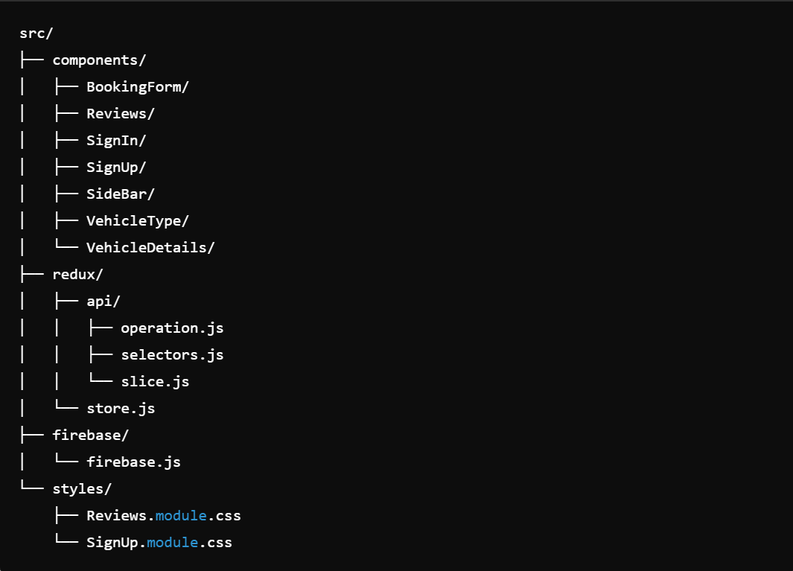

Project Documentation
This project is a React-based web application for booking and exploring various vehicles (e.g., caravans, vans) with user authentication features (sign-up, login) and filtering options to help users find the right vehicle. Below is an overview of the key components, their functionality, and relevant Redux operations.

Table of Contents:
1.Technologies Used
2.Project Structure
3.Component Overview
4.State Management
5.API Integration
6.Firebase Authentication
7.How to Use

1. Technologies Used:
   React.js: For building UI components.
   React Router: For navigation within the app.
   Redux: For state management.
   Firebase: For authentication (signup and login).
   Material UI: For icons, styling, and avatar components.
   React Hot Toast: For notifications.
   React Icons: For adding icons.

2. Project Structure:
   The project follows a typical React-based folder structure with a focus on separating concerns for each feature. The structure includes:

components/: All reusable and individual components.
redux/: Redux store, actions, and selectors.
firebase/: Firebase configuration for authentication.
styles/: CSS modules for component-specific styling.

Project Documentation
This project is a React-based web application for booking and exploring various vehicles (e.g., caravans, vans) with user authentication features (sign-up, login) and filtering options to help users find the right vehicle. Below is an overview of the key components, their functionality, and relevant Redux operations.

Table of Contents:
Technologies Used
Project Structure
Component Overview
State Management
API Integration
Firebase Authentication
How to Use
Styling

1. Technologies Used:
   React.js: For building UI components.
   React Router: For navigation within the app.
   Redux: For state management.
   Firebase: For authentication (signup and login).
   Material UI: For icons, styling, and avatar components.
   React Hot Toast: For notifications.
   React Icons: For adding icons.
2. Project Structure:
   The project follows a typical React-based folder structure with a focus on separating concerns for each feature. The structure includes:

components/: All reusable and individual components.
redux/: Redux store, actions, and selectors.
firebase/: Firebase configuration for authentication.
styles/: CSS modules for component-specific styling.
Example:

arduino
Копировать код
src/
├── components/
│ ├── BookingForm/
│ ├── Reviews/
│ ├── SignIn/
│ ├── SignUp/
│ ├── SideBar/
│ ├── VehicleType/
│ └── VehicleDetails/
├── redux/
│ ├── api/
│ │ ├── operation.js
│ │ ├── selectors.js
│ │ └── slice.js
│ └── store.js
├── firebase/
│ └── firebase.js
└── styles/
├── Reviews.module.css
└── SignUp.module.css

3. Component Overview:
   3.1. <Reviews />:
   Displays user reviews of a specific vehicle. Each review is shown with the reviewer’s name, avatar, rating, and comment.

Dependencies: useLocation, useParams, useSelector, useDispatch, getOffersById, BookingForm.
Selectors: selectItem for fetching the vehicle data.
UI Elements: Material UI’s Avatar, Rating.
3.2. <SideBar />:
A filter bar that allows users to filter vehicles by location, transmission type, and equipment like kitchen, shower, etc. This component uses local state to track the filter values.

Dependencies: useState, FilterToEquipment, VehicleType.
Props: filter function passed down from the parent component to apply the filters.
3.3. <SignIn />:
Handles user login using Firebase authentication. Takes the user's email and password, attempts login, and provides feedback via notifications.

Dependencies: signInWithEmailAndPassword from Firebase.
Navigation: After successful login, redirects to /catalog.
3.4. <SignUp />:
A form for user registration with Firebase. The user inputs their email and password, confirms the password, and upon successful account creation, they are redirected to the catalog page.

Validation: Ensures password and repeat password fields match.
Dependencies: createUserWithEmailAndPassword from Firebase.
3.5. <VehicleDetails />:
Displays the detailed specifications of a vehicle such as form, length, width, height, tank size, and fuel consumption.

Props: details (contains the vehicle's properties).
UI: Organized as an unordered list of details.
3.6. <VehicleType />:
Allows users to select a vehicle type (e.g., Panel Truck, Integrated, Alcove). It manages the selected vehicle type in the filter and communicates the selected value back via props.

Props: filtersValue, handleVehicleTypeChange.
3.7. <WelcomeSection />:
A simple welcome section to greet users and introduce the purpose of the app. It contains a title, a short description, and a background image.

4. State Management:
   Redux is used to manage global state, particularly for fetching vehicle data and managing the filter state.

Redux Slice (api/slice.js):
The slice manages vehicle offers and reviews fetched from an external API.
Actions include getOffersById to fetch offers by their ID.
Selectors:
selectItem: Retrieves the current vehicle data from the Redux store.
Operation (api/operation.js):
This file contains asynchronous functions (such as getOffersById) which dispatch actions to fetch data. 5. API Integration:
Vehicle data is fetched from an external API using the Redux getOffersById operation.

The API call happens within the useEffect hook inside the Reviews component whenever the vehicle ID changes.
The fetched data is stored in the Redux store and accessed via selectItem to display details such as reviews. 6. Firebase Authentication:
Firebase is used for both user authentication (login and signup).

Firebase Configuration (firebase/firebase.js): Contains the Firebase configuration and initialization code.
Authentication Methods:
createUserWithEmailAndPassword: Used in the SignUp component for creating new accounts.
signInWithEmailAndPassword: Used in the SignIn component for login. 7. How to Use:
Sign Up:

Navigate to the sign-up page.
Enter your email and password.
Confirm your password and click "Create" to register.
Sign In:

Navigate to the sign-in page.
Enter your email and password.
On successful login, you'll be redirected to the catalog page.
Search and Filter Vehicles:

Use the sidebar to filter vehicles by location, equipment, and vehicle type.
Click "Search" to see the filtered results.
View Reviews:

Navigate to a vehicle’s page to view user reviews and ratings.
